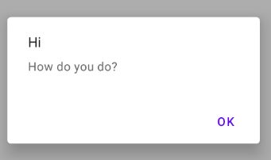
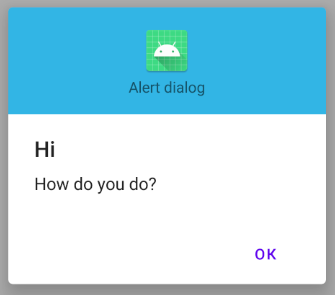
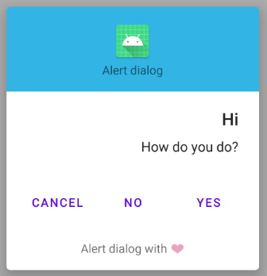

## AlertDialog - Customizable alert dialog with retained callback actions

#### [Sample app](app/src/main/java/io/github/khoben/alertdialog/sample/MainActivity.kt)

### Usage
#### Setup default alert dialog params

Should be called once at Application.OnCreate() or smth:
```kotlin
Alert.defaultConfig {
   dialogStyle = R.style.MaterialAlertDialog_MaterialComponents
   headerLayoutResource = R.layout.dialog_header
   footerLayoutResource = R.layout.dialog_footer
   dialogIsCancellable = false
}
```
#### Create AlertDialog

```kotlin
private val SAMPLE_DIALOG_TAG = "SAMPLE_DIALOG_TAG"

...

Alert.create()
    .title("Hi")
    .message("How do you do?")
    .style(R.style.MaterialAlertDialog_MaterialComponents)
    .withButtonCallback(dialogTag = SAMPLE_DIALOG_TAG) // enable button callback
    .positiveButton("+")    // add button with callback
    .neutralButton("=")     // add button with callback
    .negativeButton("-")    // add button with callback
    .header(R.layout.dialog_header)
    .cancellable(false)
    .buttonsCentered()  // makes button layout centered
    .titleAlignment(LayoutAlign.CENTER)
    .messageAlignment(LayoutAlign.CENTER)
    .show(this)
```
<table>
    <td>
        <p align="center"> <br>Simple</p>
    </td>
     <td>
        <p align="center"><br>With header</p>
    </td>
     <td>
        <p align="center"><br>Full equipment</p>
    </td>
</table>

Listen alert dialog button click events:
```kotlin
// Implement CustomDialogEventListener to catch button click events from alert dialog buttons
class MainActivity : AppCompatActivity(R.layout.activity_main), 
CustomDialogEventListener {

    ...

    // from CustomDialogEventListener
    override fun onNegativeClickEvent(event: DialogEvent.NegativeButtonEvent) {
        event.doIfTagMatches(SAMPLE_DIALOG_TAG) {
            Toast.makeText(this, "${event.dialogTag} onNegativeClickEvent", Toast.LENGTH_SHORT)
                .show()
        }
    }

    // from CustomDialogEventListener
    override fun onNeutralClickEvent(event: DialogEvent.NeutralButtonEvent) {
        event.doIfTagMatches(SAMPLE_DIALOG_TAG) {
            Toast.makeText(this, "${event.dialogTag} onNeutralClickEvent", Toast.LENGTH_SHORT)
                .show()
        }
    }

    // from CustomDialogEventListener
    override fun onPositiveClickEvent(event: DialogEvent.PositiveButtonEvent) {
        event.doIfTagMatches(SAMPLE_DIALOG_TAG) {
            Toast.makeText(this, "${event.dialogTag} onPositiveClickEvent", Toast.LENGTH_SHORT)
                .show()
        }
    }
}
```

### Installation
1. Add the JitPack repository to your build file:
    ```bash
    allprojects {
        repositories {
            ...
            maven { url 'https://jitpack.io' }
        }
    }
    ```
2. Add the dependency

    Latest version is⠀[](https://jitpack.io/#khoben/alertdialog)

    ```bash
    dependencies {
        implementation 'com.github.khoben:alertdialog:<latest_version>'
    }
    ```

