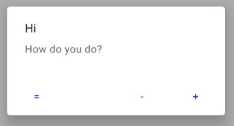

## AlertDialog - Custom alert dialog with retained callback action

### Usage

#### Simple alert dialog (single ok button)

```kotlin
CustomAlert.simple("Hi", "How do you do?")
                .show(supportFragmentManager, "Test")
```

<p align="center"></p>

#### Custom alert dialog

```kotlin
CustomAlert.custom("SAMPLE_DIALOG_TAG", "Hi", "How do you do?")
    .enablePositive("+")
    .enableNeutral("=")
    .enableNegative("-")
    .build()
    .show(supportFragmentManager, "SAMPLE_DIALOG_TAG")
```
<p align="center"></p>

Listen alert dialog button click events:
```kotlin
// For listent events implement CustomDialogEventListener
class MainActivity : AppCompatActivity(R.layout.activity_main), 
CustomDialogEventListener {

    ...

    // from CustomDialogEventListener
    override fun onNegativeClickEvent(event: DialogEvent.NegativeButtonEvent) {
        event.doIfTagMatches(SAMPLE_DIALOG_TAG) {
            Toast.makeText(this, "${event.dialogTag} onNegativeClickEvent", Toast.LENGTH_SHORT)
                .show()
        }
    }

    // from CustomDialogEventListener
    override fun onNeutralClickEvent(event: DialogEvent.NeutralButtonEvent) {
        event.doIfTagMatches(SAMPLE_DIALOG_TAG) {
            Toast.makeText(this, "${event.dialogTag} onNeutralClickEvent", Toast.LENGTH_SHORT)
                .show()
        }
    }

    // from CustomDialogEventListener
    override fun onPositiveClickEvent(event: DialogEvent.PositiveButtonEvent) {
        event.doIfTagMatches(SAMPLE_DIALOG_TAG) {
            Toast.makeText(this, "${event.dialogTag} onPositiveClickEvent", Toast.LENGTH_SHORT)
                .show()
        }
    }
}
```

### Installation
1. Add the JitPack repository to your build file:
    ```bash
    allprojects {
        repositories {
            ...
            maven { url 'https://jitpack.io' }
        }
    }
    ```
2. Add the dependency

    Latest version is⠀[](https://jitpack.io/#khoben/alertdialog)

    ```bash
    dependencies {
        implementation 'com.github.khoben:alertdialog:<latest_version>'
    }
    ```

### [Sample app](app/src/main/java/io/github/khoben/alertdialog/sample/MainActivity.kt)
